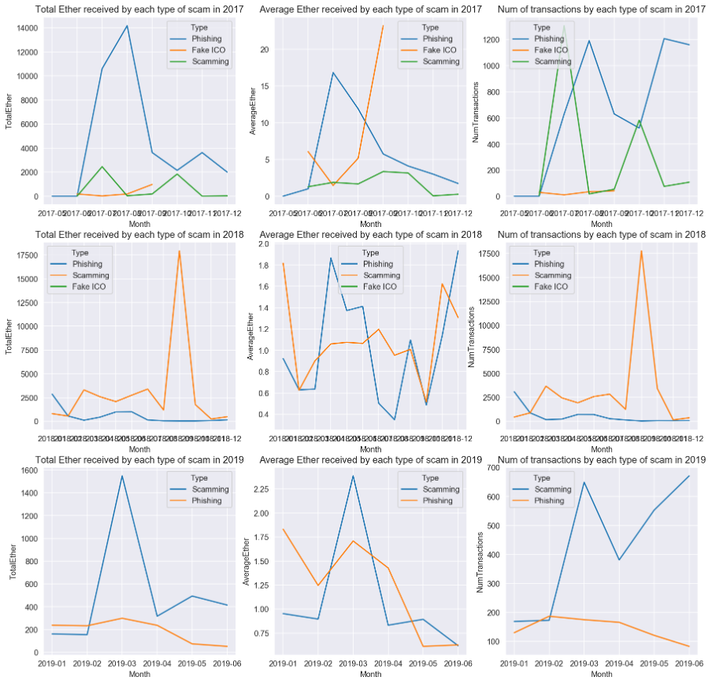

# Part D - Scam Analysis
## Requirement
This part was an optional task of the coursework. The task was to analyse different types of scams over time.

## Deliverable
- [PartD_MonthlyScamTransactions.py](./PartD_MonthlyScamTransactions.py)
- [PartD_ScamsJSONtoCSV.py](./PartD_ScamsJSONtoCSV.py)
- [PartD_MostLucrativeScam.ipynb](./PartD_MostLucrativeScam.ipynb)

## Results
First, a Python programme PartD_ScamsJSONtoCSV.py was prepared to convert the scams data from JSON to CSV. Since the JSON file contains about only 1300 records, the programme can run efficiently without the computing power from Hadoop or Spark. Therefore, this programme was designed to be executed locally.

Next, a Spark job, PartD_MonthlyScamTransactions.py, was prepared to aggregate the following information from the transactions data set:
•	Total Ether received by each type of scam each month
•	Number of transactions involved in each type of scam each month
•	Average Ether per transaction involved in each type of scam each month
